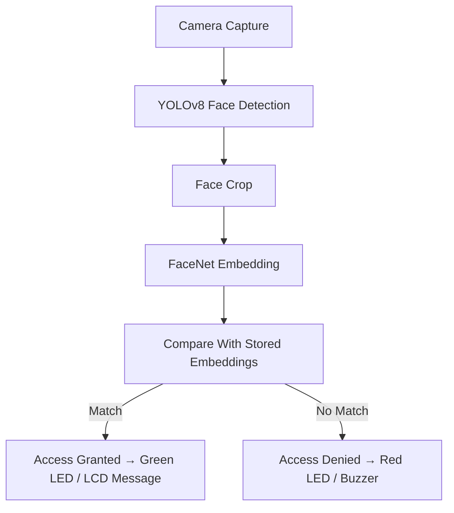

# 🛡️ Real-Time Face Recognition Security System  
### Raspberry Pi 5 · Camera Module 3 · Hailo-8 기반 경량 딥러닝 실시간 얼굴 인식 보안 장치

## 📌 프로젝트 개요
본 프로젝트는 **Raspberry Pi 5**, **Camera Module 3**, **Hailo-8 Neural Network Accelerator**를 이용하여  
저전력 환경에서도 실시간으로 얼굴을 검출하고 등록된 사용자 여부를 판단하는 **보안 출입 시스템**이다.

YOLOv8 모델을 활용한 **얼굴 검출**, FaceNet 기반 **임베딩 생성**,  
그리고 등록된 사용자 임베딩과의 **거리 비교 기반 인증 방식**을 사용한다.

또한 GPIO를 통한 **초록/빨간 LED**, **부저**, **미니 LCD 디스플레이**를 제어하여  
직관적인 보안 피드백을 제공한다.

## 📂 프로젝트 디렉토리 구조
```text
face-security-system/
├─ README.md
├─ requirements.txt
├─ config/
│  ├─ config.yaml
│  └─ paths.yaml
├─ models/
│  ├─ yolov8_face.onnx
│  ├─ yolov8_face_hailo.hef
│  ├─ facenet.onnx
│  └─ facenet_hailo.hef
├─ data/
│  ├─ registered_faces/
│  └─ embeddings.json
├─ logs/
│  ├─ access_log.csv
│  └─ debug.log
├─ src/
│  ├─ main.py
│  ├─ camera.py
│  ├─ detection.py
│  ├─ embedding.py
│  ├─ recognition.py
│  ├─ gpio_control.py
│  ├─ lcd_display.py
│  ├─ modes/
│  │  ├─ register_mode.py
│  │  └─ recognize_mode.py
│  └─ utils/
│     ├─ preprocess.py
│     ├─ config_loader.py
│     └─ logging_utils.py
└─ scripts/
   ├─ convert_to_hailo.sh
   └─ benchmark.py
```

## 🔧 핵심 모듈 설명
### camera.py
- Picamera2/libcamera 기반 실시간 프레임 캡처  
- RGB 변환 및 필요한 전처리 수행

### detection.py
- YOLOv8 얼굴 검출  
- CPU/Hailo 추론을 공통 인터페이스로 제공  
- 출력: bounding boxes 리스트

### embedding.py
- FaceNet 모델을 통한 임베딩 생성  

### recognition.py
- 등록된 사용자 임베딩 로드  
- 거리 기반 매칭 및 임계값 판정

### gpio_control.py
- LED/부저/버튼 GPIO 제어

### lcd_display.py
- LCD 텍스트/이미지 출력

### register_mode.py / recognize_mode.py
- 사용자 등록 및 실시간 인식 모드 동작 구현

## ▶️ 실행 방법 (Quick Start)
### 1. 패키지 설치
```bash
pip install -r requirements.txt
```

### 2. 사용자 등록
```bash
python src/main.py --mode register
```

### 3. 실시간 얼굴 인식
```bash
python src/main.py --mode recognize
```

## 🖥️ 시스템 흐름도


## ⚙️ 하드웨어 구성
```text
Raspberry Pi 5
 ├─ Camera Module 3
 ├─ Hailo-8 (PCIe)
 ├─ LCD Display
 ├─ Green LED  (GPIO 17)
 ├─ Red LED    (GPIO 27)
 └─ Buzzer     (GPIO 22)
```

## 📝 License
MIT License
